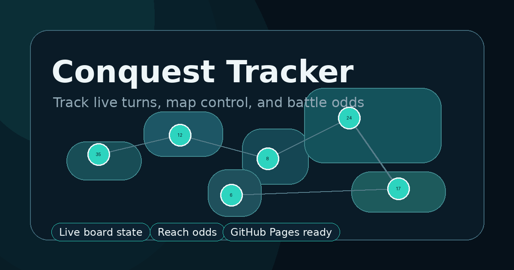

# Conquest Tracker

Conquest Tracker is a local-first web app for tracking a live strategy board game from setup through full turn-by-turn play. It is designed for casual players who want a clean map, clear ownership/troop tracking, and quick probability context while the game is happening.

The app is static HTML, CSS, and JavaScript. There is no backend, login, build process, database, or package install required, which makes it easy to publish directly with GitHub Pages.



## Live demo

After GitHub Pages is enabled, add the deployed site URL here:

```text
https://your-username.github.io/conquest-tracker/
```

## What it does

- Creates a 2–6 player game with custom names, colors, and turn order.
- Guides the initial territory claiming and troop-stacking flow.
- Displays all 42 territories on an original world-map-style board.
- Tracks owners, troop counts, continent control, reinforcements, attacks, captures, fortifications, eliminations, and victory.
- Saves progress locally in the browser so the game can survive refreshes.
- Supports undo for recent meaningful actions.
- Shows reach-odds estimates for the active player.
- Uses exact true-random dice math for individual battles.
- Keeps probability and recommendations advisory; the board only changes when the user records an action.

## Why I built it

Online strategy games move quickly, and doing the math behind every possible attack path is hard while people are taking turns. Conquest Tracker is meant to make the game easier to follow by turning the board state into a clean, interactive dashboard.

It is especially useful for answering questions like:

- Who controls each continent?
- How many reinforcements should this player receive?
- Which territories can this stack realistically reach?
- How likely is a capture from one territory into another?
- When has a player been eliminated or won?

## How to use it

1. Add the players, colors, and turn order.
2. Start the territory draft.
3. Click territories as players claim them.
4. Stack the remaining starting troops.
5. Begin live turns.
6. Record reinforcements, attacks, captures, and fortifications as they happen.
7. Toggle reach odds when you want probability context for the active player.

## Run locally

### Option 1: VS Code Live Server

1. Open this folder in VS Code.
2. Install the recommended **Live Server** extension if prompted.
3. Open `index.html`.
4. Click **Go Live** in the VS Code status bar.
5. Open `http://127.0.0.1:5500/` if the browser does not open automatically.

### Option 2: Python local server

```bash
python -m http.server 5500
```

Then open:

```text
http://127.0.0.1:5500/
```

## Deploy with GitHub Pages

1. Create a new GitHub repository, for example `conquest-tracker`.
2. Upload these project files to the root of the repository.
3. Go to **Settings → Pages**.
4. Under **Build and deployment**, choose **Deploy from a branch**.
5. Select the `main` branch and the `/ (root)` folder.
6. Save.
7. After GitHub finishes deploying, open the new Pages URL.
8. Paste that URL into the **Live demo** section above and into your LinkedIn post.

GitHub Pages can publish a static site directly from a repository branch, and GitHub lets you choose either the repository root or a `/docs` folder as the publishing source.


## LinkedIn sharing checklist

Before posting the project publicly:

- Replace the placeholder live-demo URL above with your real GitHub Pages link.
- Add that same link to your GitHub repository description.
- Confirm the homepage loads in an incognito browser window.
- Check that `assets/social-preview.png` appears in the README and looks good as the project preview image.
- If LinkedIn does not pick up the preview image automatically, update the `og:image` tag in `index.html` to the full deployed image URL.

## Project structure

```text
index.html              App shell, page metadata, and root layout
styles.css              Responsive styling, map UI, and game panels
assets/                 Favicon and social preview image
src/main.js             Game state, rendering, validation, persistence, and UI events
src/map-data.js         Territories, continent metadata, coordinates, and adjacency
src/probability.js      Battle probability calculations
src/strategy.js         Reach-odds and route-estimation helpers
docs/architecture.md    Technical overview and state model
docs/visual-qa.md       Manual browser QA checklist
```

## Notes on probability

Single-battle probabilities use exact true-random dice distributions. Multi-territory reach odds are estimates because the route engine summarizes likely survivor counts between battles instead of simulating every full-board future state.

Large battles are normalized for browser performance. Odds are meant to support decision-making, not replace judgment.

## Roadmap

- Add import/export for saved games.
- Add a calibrated probability table option.
- Add clearer route explanations on map hover.
- Add continent-breaking recommendations.
- Add conservative, balanced, and aggressive strategy modes.
- Add a lightweight screenshot/export view for sharing game states.

## Disclaimer

This is an independent companion tool for a classic conquest-style strategy board game. It uses original map artwork and does not include official board art, logos, screenshots, or proprietary game code.
